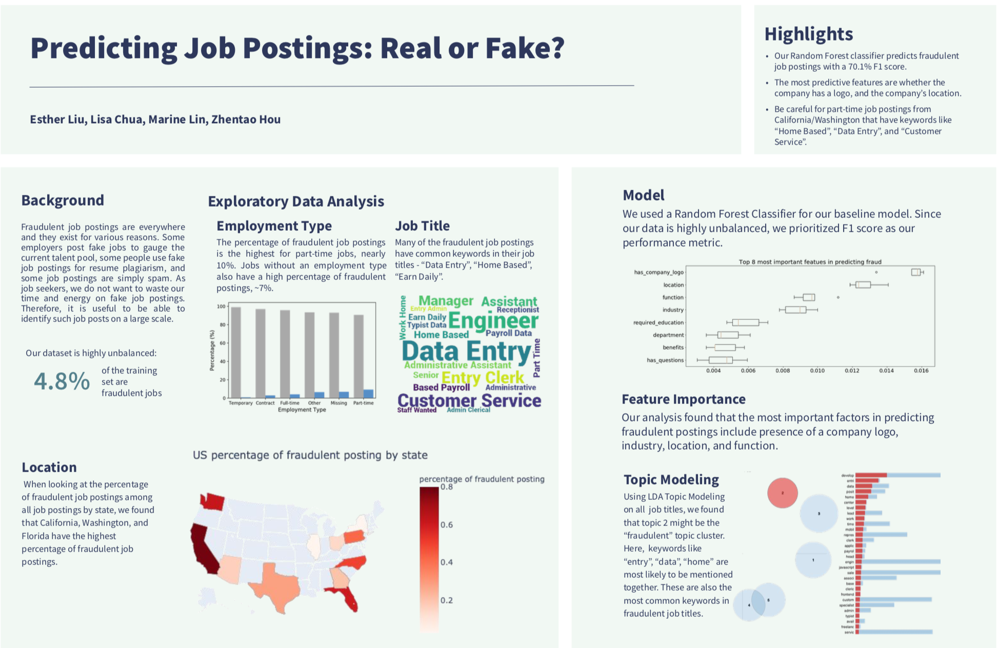
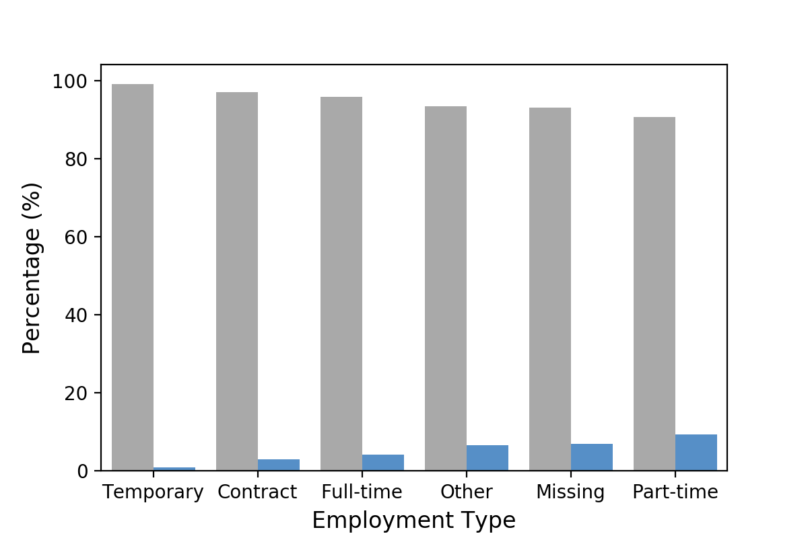
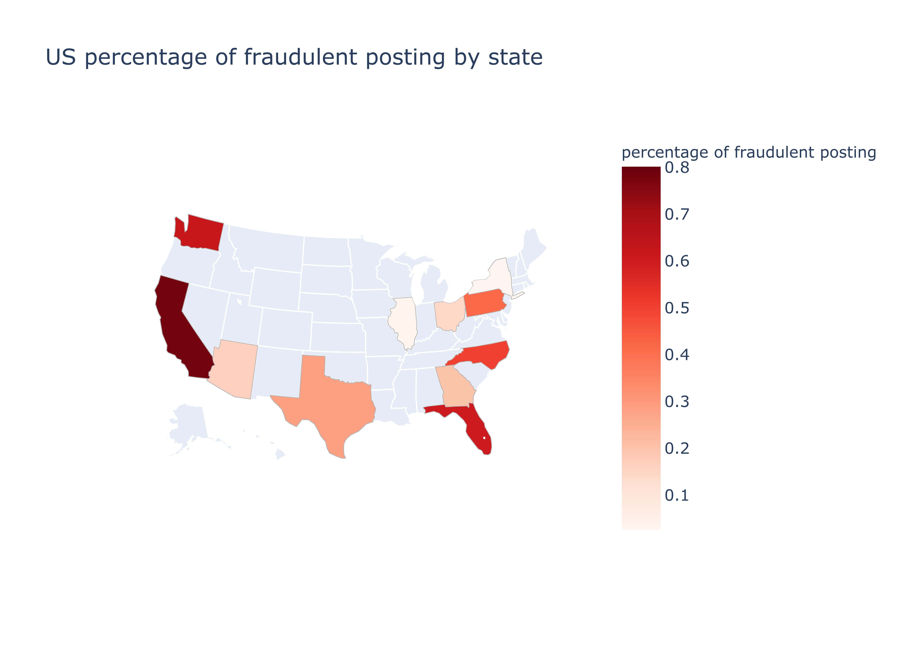
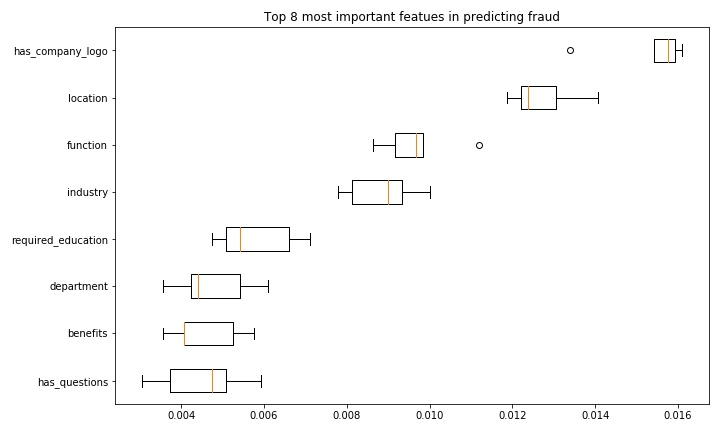
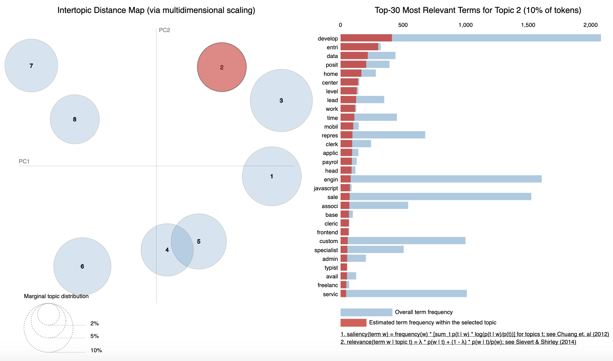

# Predicting Job Postings: Real or Fake?

## Highlights:
- Our Random Forest classifier predicts fraudulent job postings with a 70.1% F1 score.
- The most predictive features are whether the company has a logo, and the company’s location.
- Be careful for part-time job postings from California/Washington that have keywords like “Home Based”, “Data Entry”, and “Customer Service”.

## Background
Fraudulent job postings are everywhere and they exist for various reasons. Some employers post fake jobs to gauge the current talent pool, some people use fake job postings for resume plagiarism, and some job postings are simply spam. As job seekers, we do not want to waste our time and energy on fake job postings. Therefore, it is useful to be able to identify such job posts on a large scale.

Our data: 
This [dataset](https://www.kaggle.com/shivamb/real-or-fake-fake-jobposting-prediction) contains 18K job descriptions out of which about 800 are fake. The data consists of both textual information and meta-information about the jobs. 

The University of the Aegean | Laboratory of Information & Communication Systems Security
http://emscad.samos.aegean.gr/

## Exploratory Data Analysis
### Employment Type
The percentage of fraudulent job postings is the highest for part-time jobs, nearly 10%. Jobs without an employment type also have a high percentage of fraudulent postings, ~7%.

### Job Title
Many of the fraudulent job postings have common keywords in their job titles - “Data Entry”, “Home Based”, “Earn Daily”.

### Location
When looking at the percentage of fraudulent job postings among all job postings by state, we found that California, Washington, and Florida have the highest percentage of fraudulent job postings.

## Model
We used a Random Forest Classifier for our baseline model. Since our data is highly unbalanced, we prioritized F1 score as our performance metric.

### Feature Importance 
Our analysis found that the most important factors in predicting fraudulent postings include presence of a company logo, industry, location, and function.

### Topic Modeling 
Using LDA Topic Modeling on all  job titles, we found that topic 2 might be the “fraudulent” topic cluster. Here,  keywords like “entry”, “data”, “home” are most likely to be mentioned together. These are also the most common keywords in fraudulent job titles. 

